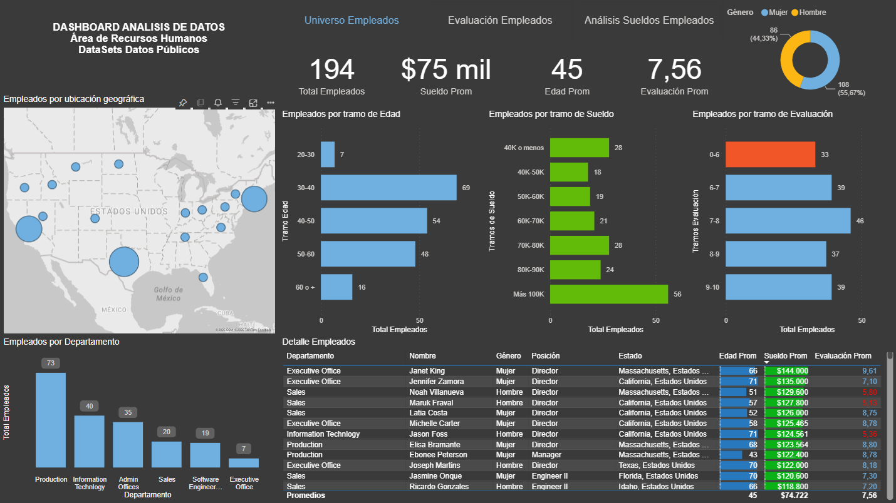
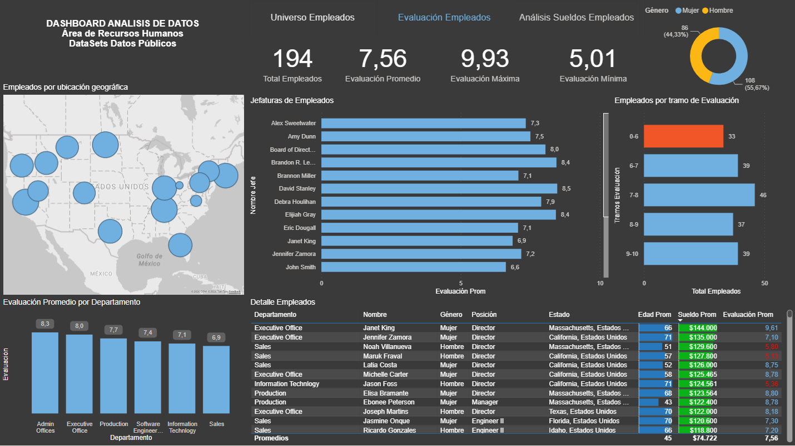
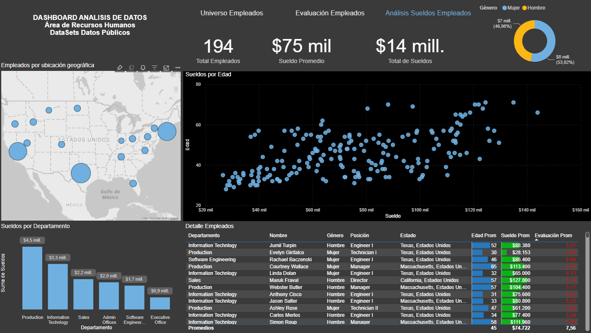

# 📊 Análisis de Recursos Humanos - Dashboard Power BI

## Descripción del Proyecto

Proyecto de análisis de datos orientado al área de Recursos Humanos desarrollado en Microsoft Power BI utilizando un conjunto de datos públicos.

El objetivo principal del dashboard es analizar indicadores relevantes de empleados, permitiendo explorar variables demográficas, salariales, desempeño laboral y distribución organizacional para facilitar la toma de decisiones estratégicas dentro del área de gestión de personas.

---

## Objetivos del Análisis

Este proyecto busca responder preguntas de negocio como:

- ¿Cuál es la distribución geográfica de los empleados?
- ¿Cómo se distribuyen los empleados según rango etario?
- ¿Qué departamentos concentran mayor cantidad de colaboradores?
- ¿Cuál es la distribución salarial por área?
- ¿Existe relación entre salario, edad y evaluación de desempeño?
- ¿Cómo se distribuye el desempeño de los empleados dentro de la organización?

---

## Herramientas Utilizadas

- Microsoft Power BI Desktop
- Power Query
- Modelado de datos relacional
- Lenguaje DAX
- Visualización de datos
- Storytelling con datos

---

## Indicadores Analizados (KPIs)

### Universo de empleados

- Total de empleados
- Edad promedio
- Distribución por género
- Distribución geográfica

### Evaluación de desempeño

- Evaluación promedio
- Evaluación máxima
- Evaluación mínima
- Desempeño por rango de evaluación
- Evaluación promedio por departamento
- Ranking de jefaturas

### Análisis salarial

- Sueldo promedio
- Masa salarial total
- Sueldo por departamento
- Distribución salarial por rangos
- Relación entre edad y salario

---

## Funcionalidades del Dashboard

El dashboard fue diseñado con navegación interactiva entre múltiples vistas analíticas:

### Vista 1 — Universo de empleados

Permite explorar:

- distribución etaria
- distribución salarial
- empleados por departamento
- análisis geográfico
- detalle individual de empleados

### Vista 2 — Evaluación de empleados

Permite analizar:

- desempeño promedio general
- ranking de líderes y jefaturas
- distribución por niveles de evaluación
- comparación entre departamentos

### Vista 3 — Análisis de sueldos

Permite visualizar:

- sueldo promedio
- masa salarial total
- salarios por departamento
- relación entre salario y edad
- análisis individual por empleado

---

## Principales Insights del Proyecto

A través del análisis realizado es posible identificar:

- departamentos con mayor concentración de personal
- diferencias salariales entre áreas
- patrones de desempeño laboral
- relación entre compensación y experiencia
- comportamiento demográfico de la organización

---

## Vista del Dashboard

### Universo de empleados

[Agregar captura aquí]

### Evaluación empleados

[Agregar captura aquí]

### Análisis de sueldos

[Agregar captura aquí]

---

## Competencias Técnicas Demostradas

Este proyecto demuestra experiencia práctica en:

- Business Intelligence
- Modelado de datos
- Diseño de dashboards ejecutivos
- Análisis exploratorio de datos
- Visualización orientada a negocio
- Definición de KPIs
- Diseño de reportes interactivos

---

## Autor

Desarrollado como proyecto de portafolio profesional orientado a roles:

- Data Analyst
- BI Analyst
- Business Analyst
- Junior Data Engineer

GitHub Portfolio en construcción 🚀
